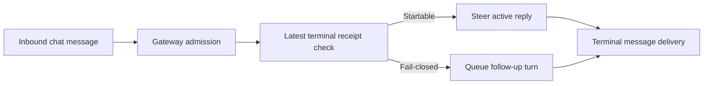

Codex review: needs real behavior proof before merge. _Reviewed August 26, 2026, 7:48 PM ET / 23:48 UTC._

# ClawSweeper review

## What this changes

The PR routes an inbound message to the ordered follow-up queue instead of steering it into an active reply that can no longer safely send a terminal source reply.

## Regression provenance

Possible regression — probable (reviewed change; failure trace). No predecessor PR is attributed.

## Merge readiness

⛔ **Blocked until real behavior proof from a real setup is added - 5 items remain**

Keep open. The prior tombstone-scope blocker is fixed on the current head and the pre-queue fence is the right owner boundary, but the PR still has only mocked/unit evidence for a silent message-delivery path and retains one unused production helper.

**Priority:** P1
**Reviewed head:** `4691a828fcfa2b346e20021b9f84574b00554c0c`

## Review scores

| Measure | Result | What it means |
|---|---|---|
| **Overall readiness** | 🦪 silver shellfish **(2/6)** | The implementation is a credible owner-boundary repair, but merge readiness is capped by missing real behavior proof. |
| **Proof confidence** | 🦪 silver shellfish **(2/6)** | Needs real behavior proof before merge: Mock-only: the supplied tests establish red-to-green admission logic, but the gateway test manually calls a follow-up spy rather than showing real dispatch and an observed after-fix reply; add redacted ephemeral-gateway/transport evidence before merge. After adding proof, update the PR body; ClawSweeper should re-review automatically. If it does not, the PR author or someone with repository write access can comment `@clawsweeper re-review`. |
| **Patch quality** | 🐚 platinum hermit **(4/6)** | 1 actionable review finding remain. |

## Verification

| Check | Result | Evidence |
|---|---|---|
| **Real behavior** | Needs proof | Needs real behavior proof before merge: Mock-only: the supplied tests establish red-to-green admission logic, but the gateway test manually calls a follow-up spy rather than showing real dispatch and an observed after-fix reply; add redacted ephemeral-gateway/transport evidence before merge. After adding proof, update the PR body; ClawSweeper should re-review automatically. If it does not, the PR author or someone with repository write access can comment `@clawsweeper re-review`. |
| **Evidence reviewed** | 6 items | Current-main gap: Current main starts active-run injection directly without a terminal-receipt admission fence, so the central behavior is not already implemented.<br>Pre-queue repair boundary: The PR reloads the latest entry and rejects a fail-closed receipt before calling the injection function, whose queue call is synchronous.<br>Receipt-owner contract: The shared classifier mirrors the terminal-send disposition, while the outbound owner converts stale or ambiguous dispositions into a delivered:false no-send result. |
| **Findings** | 1 actionable finding | [P3] Remove the now-unused any-tombstone helper |
| **Security** | None | None. |


### Live Verification

**Command:** `pnpm openclaw --help`

**Result:** PASS (completed)

```text
$ node scripts/run-node.mjs --help
[openclaw] Building TypeScript (dist is stale: missing_build_stamp - build stamp missing).
[openclaw] Building bundled plugin assets.
[canvas] build: node scripts/bundle-a2ui.mjs
[log] ‹DIR›/a2ui.bundle.js  chunk │ size: 399.96 kB
[log] ‹DIR›/a2ui-v0.9.bundle.js  chunk │ size: 615.66 kB
[log]
[success] rolldown v1.2.0 Finished in 105.50 ms
[diffs] build: node --import tsx ../../scripts/build-diffs-viewer-runtime.mts curated
[diffs-language-pack] build: node --import tsx ../../scripts/build-diffs-viewer-runtime.mts full
[discord] build: node --import tsx ../../scripts/build-discord-activity-sdk.mts
[tsdown-build] invocation 1/2 finished in 0.7s
node_modules/playwright-core/lib/coreBundle.js (65821:28) [EVAL] Use of direct ˋevalˋ function is strongly discouraged as it poses security risks and may cause
issues with minification.
       ╭─[ node_modules/playwright-core/lib/coreBundle.js:65821:29 ]
       │
 65821 │               const value = eval(ˋ(${expr})ˋ);
       │                             ──┬─
       │                               ╰─── Use of direct ˋevalˋ here.
       │
       │ Help: Consider using indirect eval. For more information, check the documentation: https://rolldown.rs/guide/troubleshooting#avoiding-direct-eval
───────╯

node_modules/playwright-core/lib/coreBundle.js (65828:28) [EVAL] Use of direct ˋevalˋ function is strongly discouraged as it poses security risks and may cause
issues with minification.
       ╭─[ node_modules/playwright-core/lib/coreBundle.js:65828:29 ]
       │
 65828 │               const value = eval(ˋ(${expr})ˋ);
       │                             ──┬─
       │                               ╰─── Use of direct ˋevalˋ here.
       │
       │ Help: Consider using indirect eval. For more information, check the documentation: https://rolldown.rs/guide/troubleshooting#avoiding-direct-eval
───────╯

node_modules/web-tree-sitter/web-tree-sitter.js (2343:30) [EVAL] Use of direct ˋevalˋ function is strongly discouraged as it poses security risks and may cause
issues with minification.
      ╭─[ node_modules/web-tree-sitter/web-tree-sitter.js:2343:31 ]
      │
 2343 │           ASM_CONSTS[start] = eval(func);
      │                               ──┬─
      │                                 ╰─── Use of direct ˋevalˋ here.
      │
      │ Help: Consider using indirect eval. For more information, check the documentation: https://rolldown.rs/guide/troubleshooting#avoiding-direct-eval
──────╯

node_modules/web-tree-sitter/web-tree-sitter.js (2366:32) [EVAL] Use of direct ˋevalˋ function is strongly discouraged as it poses security risks and may cause
issues with minification.
      ╭─[ node_modules/web-tree-sitter/web-tree-sitter.js:2366:33 ]
      │
 2366 │           moduleExports[name] = eval(func);
      │                                 ──┬─
      │                                   ╰─── Use of direct ˋevalˋ here.
      │
      │ Help: Consider using indirect eval. For more information, check the documentation: https://rolldown.rs/guide/troubleshooting#avoiding-direct-eval
──────╯

[tsdown-build] invocation 2/2 finished in 14.3s
[plugin-control-plane-loads] verified 36 built modules with native require and checked doctor closures
runtime-postbuild: 11 phases completed in 4357ms (slowest: built plugin control-plane loads 3612ms)

OpenClaw 2026.8.1 (4691a82) — All your chats, one OpenClaw.

Usage: openclaw [options] [command]

Options:
  --container ‹name›   Run the CLI inside a running Podman/Docker container named ‹name› (default: env OPENCLAW_CONTAINER)
  --dev                Dev profile: isolate state under ~/.openclaw-dev, default gateway port 19001, and shift derived ports (browser/canvas)
  -h, --help           Display help for command
  --log-level ‹level›  Global log level override for file + console (silent|fatal|error|warn|info|debug|trace)
  --no-color           Disable ANSI colors
  --profile ‹name›     Use a named profile (iso
… output truncated …
```

**Assertions:**

- PASS `expect_output`: Usage: openclaw [options] [command]

## How this fits together

The gateway can inject an inbound message into an active auto-reply run, while the auto-reply subsystem owns the durable terminal-delivery receipt. This change checks that receipt before injection so each inbound has either a safe steer or a separate follow-up turn.



## Before merge

- [ ] **Add real behavior proof** - Needs real behavior proof before merge: Mock-only: the supplied tests establish red-to-green admission logic, but the gateway test manually calls a follow-up spy rather than showing real dispatch and an observed after-fix reply; add redacted ephemeral-gateway/transport evidence before merge. After adding proof, update the PR body; ClawSweeper should re-review automatically. If it does not, the PR author or someone with repository write access can comment `@clawsweeper re-review`.
- [ ] **Remove the now-unused any-tombstone helper (P3)** - The final exact-source classifier no longer calls this helper, and repository search finds no other caller. Remove it so the earlier broad-tombstone approach does not remain as dead production API.
- [ ] **Resolve merge risk (P1)** - A merge would change a silent message-delivery path without an after-fix gateway/transport trace proving that the inbound is dispatched exactly once and produces an observable reply.
- [ ] **Resolve merge risk (P1)** - The bug fix adds a net 234 production lines; the unused any-tombstone helper is avoidable production growth.
- [ ] **Complete next step (P2)** - The remaining merge blocker is contributor-owned real behavior proof, not an autonomous repair task.

## Findings

- [P3] Remove the now-unused any-tombstone helper — `src/config/sessions/restart-recovery-state.ts:445-448`


<details>
<summary><strong>Agent review details</strong></summary>

### Security

None.

### PR surface

Source +234, Tests +654. Total +888 across 12 files.

<details>
<summary>View PR surface stats</summary>

| Area | Files | Added | Removed | Net |
|---|---:|---:|---:|---:|
| Source | 9 | 272 | 38 | +234 |
| Tests | 3 | 657 | 3 | +654 |
| Docs | 0 | 0 | 0 | 0 |
| Config | 0 | 0 | 0 | 0 |
| Generated | 0 | 0 | 0 | 0 |
| Other | 0 | 0 | 0 | 0 |
| **Total** | **12** | **929** | **41** | **+888** |

</details>

### Review metrics

| Metric | Value | Why it matters |
|---|---|---|
| **Production versus regression coverage** | production +272/-38 (net +234); tests +657/-3 (net +654) | The sizeable production expansion is justified only if the shared receipt classification and dual admission fences are demonstrated at the real dispatch boundary. |

### Stored data model

Persistent data-model change detected: `serialized state: src/config/sessions/restart-recovery-receipt.test.ts`, `serialized state: src/config/sessions/restart-recovery-receipt.ts`, `serialized state: src/config/sessions/restart-recovery-state.ts`, `unknown-data-model-change: src/config/sessions/restart-recovery-receipt.test.ts`, `unknown-data-model-change: src/config/sessions/restart-recovery-receipt.ts`. Confirm migration or upgrade compatibility proof before merge.

### Root-cause cluster

Relationship: `fixed_by_candidate`
Canonical: https://github.com/openclaw/openclaw/issues/128971
Summary: This PR is the active candidate fix for the reported terminal-receipt silent-delivery failure.

Members:
- `canonical`: https://github.com/openclaw/openclaw/issues/128971 - The PR explicitly targets the issue's terminal receipt and silent reply-loss path; the issue remains open until a fixing PR lands.

Proposal only: this assessment does not dispatch repair, suppress jobs, mutate sibling items, close, or merge anything.

### Merge-risk options

**Maintainer options:**
1. **Prove the one-delivery invariant before merge (recommended)**  
   Drive the real gateway dispatch with an injected terminal receipt and a mock transport, then show zero steer enqueues, one follow-up dispatch, and one observed outbound reply.

### Technical review

Best possible solution:

Retain the pre-queue receipt fence, remove the obsolete helper, and attach a redacted ephemeral-gateway trace that proves zero doomed steers, one follow-up dispatch, and one observable reply.

Do we have a high-confidence way to reproduce the issue?

Yes, at source level: current main queues directly into the active reply, while the PR's receipt-state tests exercise the fail-closed admission cases. I did not execute the untrusted contributor branch.

Is this the best way to solve the issue?

Yes, in source: checking immediately before synchronous queueing is the narrowest layer that can prevent the doomed steer, and the receipt classifier is shared with the send owner. Real dispatch proof remains necessary.

Full review comments:

- [P3] Remove the now-unused any-tombstone helper — `src/config/sessions/restart-recovery-state.ts:445-448`
  The final exact-source classifier no longer calls this helper, and repository search finds no other caller. Remove it so the earlier broad-tombstone approach does not remain as dead production API.
  Confidence: 0.99

Overall correctness: patch is correct
Overall confidence: 0.88

AGENTS.md: found and applied where relevant.

Codex review notes: model internal, reasoning high; reviewed against [c385cdc8f15f](https://github.com/openclaw/openclaw/commit/c385cdc8f15f42c4cc7345eadb4bb8765fe10a94).

### Labels

Label justifications:

- `P1`: The changed path prevents a completed user request from being silently lost after terminal delivery becomes ambiguous.
- `merge-risk: 🚨 message-delivery`: The PR changes whether inbound chat messages steer or become follow-up turns when durable delivery state changes.
- `rating: 🦪 silver shellfish`: Overall readiness is 🦪 silver shellfish; proof is 🦪 silver shellfish and patch quality is 🐚 platinum hermit.
- `status: 📣 needs proof`: The PR needs real behavior proof before ClawSweeper can clear the contributor ask. Needs real behavior proof before merge: Mock-only: the supplied tests establish red-to-green admission logic, but the gateway test manually calls a follow-up spy rather than showing real dispatch and an observed after-fix reply; add redacted ephemeral-gateway/transport evidence before merge. After adding proof, update the PR body; ClawSweeper should re-review automatically. If it does not, the PR author or someone with repository write access can comment `@clawsweeper re-review`.

### Evidence

What I checked:

- **Current-main gap:** Current main starts active-run injection directly without a terminal-receipt admission fence, so the central behavior is not already implemented. ([`src/gateway/server-methods/chat-send-message-injection.ts:59`](https://github.com/openclaw/openclaw/blob/c385cdc8f15f/src/gateway/server-methods/chat-send-message-injection.ts#L59), [c385cdc8f15f](https://github.com/openclaw/openclaw/commit/c385cdc8f15f))
- **Pre-queue repair boundary:** The PR reloads the latest entry and rejects a fail-closed receipt before calling the injection function, whose queue call is synchronous. ([`src/gateway/server-methods/chat-send-message-injection.ts:55`](https://github.com/openclaw/openclaw/blob/4691a828fcfa/src/gateway/server-methods/chat-send-message-injection.ts#L55), [4691a828fcfa](https://github.com/openclaw/openclaw/commit/4691a828fcfa))
- **Receipt-owner contract:** The shared classifier mirrors the terminal-send disposition, while the outbound owner converts stale or ambiguous dispositions into a delivered:false no-send result. ([`src/config/sessions/restart-recovery-receipt.ts:63`](https://github.com/openclaw/openclaw/blob/4691a828fcfa/src/config/sessions/restart-recovery-receipt.ts#L63), [4691a828fcfa](https://github.com/openclaw/openclaw/commit/4691a828fcfa))
- **Mock-only proof:** The added gateway contract test mocks injection and manually invokes its follow-up spy; it does not drive real chat dispatch through an ephemeral gateway and an observable transport result. ([`src/gateway/server-methods/chat-send-message-injection.test.ts:316`](https://github.com/openclaw/openclaw/blob/4691a828fcfa/src/gateway/server-methods/chat-send-message-injection.test.ts#L316), [4691a828fcfa](https://github.com/openclaw/openclaw/commit/4691a828fcfa))
- **Obsolete helper:** The any-tombstone helper has no caller after the final source-scoped classifier moved to exact matching. ([`src/config/sessions/restart-recovery-state.ts:446`](https://github.com/openclaw/openclaw/blob/4691a828fcfa/src/config/sessions/restart-recovery-state.ts#L446), [4691a828fcfa](https://github.com/openclaw/openclaw/commit/4691a828fcfa))
- **Area provenance:** Recent history identifies the gateway steering and durable source-reply surfaces as established work, with the receipt/progress behavior also maintained by an adjacent contributor. ([`src/gateway/server-methods/chat-send-message-injection.ts:34`](https://github.com/openclaw/openclaw/blob/6515f6a2555d/src/gateway/server-methods/chat-send-message-injection.ts#L34), [6515f6a2555d](https://github.com/openclaw/openclaw/commit/6515f6a2555d))

Likely related people:

- **steipete:** Recent history covers gateway-owned atomic steering and the terminal source-reply owner. (role: recent steering and delivery-surface contributor; confidence: high; commits: [6515f6a2555d](https://github.com/openclaw/openclaw/commit/6515f6a2555d1b64a47835d392c3737d2f77b3af), [d8b723fb00c2](https://github.com/openclaw/openclaw/commit/d8b723fb00c2b37e0b451b435caaa5af4de0cb94); files: `src/gateway/server-methods/chat-send-message-injection.ts`, `src/infra/outbound/source-reply-mirror.ts`)
- **Glucksberg:** Authored the recent change allowing progress before final message-tool replies, which shares the terminal receipt path. (role: adjacent receipt-behavior contributor; confidence: medium; commits: [cd7b7f639da0](https://github.com/openclaw/openclaw/commit/cd7b7f639da0d26424b52f3ffa2391f81acb5040); files: `src/config/sessions/restart-recovery-receipt.ts`)

### Rank-up moves

Optional improvements that raise the rating; they are not merge blockers.

- Attach a redacted ephemeral-gateway trace showing a fail-closed receipt produces exactly one follow-up dispatch and one observed reply.
- Delete the unused any-tombstone helper before the next review.

### Rating scale

| Score | Internal tier | Crab rank | Meaning |
|---:|:---:|---|---|
| **6/6** | S | 🦀 challenger crab | Exceptional readiness |
| **5/6** | A | 🦞 diamond lobster | Very strong readiness |
| **4/6** | B | 🐚 platinum hermit | Good normal PR; ordinary maintainer review |
| **3/6** | C | 🦐 gold shrimp | Useful, but confidence is limited |
| **2/6** | D | 🦪 silver shellfish | Proof or implementation needs work |
| **1/6** | F | 🧂 unranked krab | Not merge-ready |
| N/A | NA | 🌊 off-meta tidepool | Rating does not apply |

Overall follows the weaker of proof and patch quality.
Shiny media proof means a screenshot, video, or linked artifact directly shows the changed behavior. Runtime, network, CSP, and security claims still need visible diagnostics.

### Workflow

- ClawSweeper keeps one durable marker-backed review comment per issue or PR.
- Re-runs edit this comment so the latest verdict, findings, and automation markers stay together instead of adding duplicate bot comments.
- A fresh review can be triggered by eligible `@clawsweeper re-review` comments, exact-item GitHub events, scheduled/background review runs, or manual workflow dispatch.
- PR/issue authors and users with repository write access can comment `@clawsweeper re-review` or `@clawsweeper re-run` on an open PR or issue to request a fresh review only.
- Maintainers can also comment `@clawsweeper review` to request a fresh review only.
- Fresh-review commands do not start repair, autofix, rebase, CI repair, or automerge.
- Maintainer-only repair and merge flows require explicit commands such as `@clawsweeper autofix`, `@clawsweeper automerge`, `@clawsweeper fix ci`, or `@clawsweeper address review`.
- Maintainers can comment `@clawsweeper explain` to ask for more context, or `@clawsweeper stop` to stop active automation.

### History

<details>
<summary>Review history (5 earlier review cycles)</summary>

<!-- clawsweeper-review-history v=1 total=5 -->
- reviewed 2026-08-25T04:16:02.788Z sha a417deca2922c4561a98701b01dc74e2fc3a2d71 :: needs real behavior proof before merge. :: none
- reviewed 2026-08-25T05:36:30.093Z sha 3028ddc0ccfe6d71102969d15478089da117f4c4 :: needs real behavior proof before merge. :: [P1] Reload terminal receipt state before accepting the steer
- reviewed 2026-08-25T13:09:29.632Z sha 54cdd803278539f604d1a13033ff25ddb0e22648 :: needs real behavior proof before merge. :: [P1] Fence before starting the gateway injection
- reviewed 2026-08-25T15:23:15.305Z sha 89671048f597f338ab1f2604ae1562ac558a625b :: needs real behavior proof before merge. :: [P1] Scope the tombstone fence to the active source turn
- reviewed 2026-08-26T19:31:42.287Z sha 0d3ee5553b09a3926936a70e331cc6dd4ee4d099 :: needs real behavior proof before merge. :: [P1] Scope tombstone checks to the active source turn

</details>

</details>

<!-- clawsweeper-verdict:needs-human item=129001 sha=4691a828fcfa2b346e20021b9f84574b00554c0c confidence=high updated_at=2026-08-26T23:44:50Z reviewed_at=2026-08-26T23:48:29.367Z lease_owner=github-run-33024353809-1 lease_comment_id=5432420090 source_revision=aed86c2fd8d0f814f8c1c1a6bcf03e6398339accfd9160566dbc566490636b16 -->

<!-- clawsweeper-review-version item=129001 reviewed_at=2026-08-26T23:48:29.367Z sha=4691a828fcfa2b346e20021b9f84574b00554c0c source_revision=aed86c2fd8d0f814f8c1c1a6bcf03e6398339accfd9160566dbc566490636b16 lease_owner=github-run-33024353809-1 lease_comment_id=5432420090 v=1 -->

<!-- clawsweeper-review item=129001 -->
