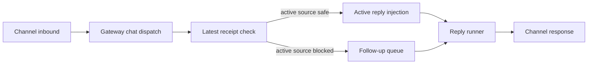

Codex review: needs real behavior proof before merge. _Reviewed August 26, 2026, 3:31 PM ET / 19:31 UTC._

# ClawSweeper review

## What this changes

The PR moves terminal-receipt validation ahead of active-reply injection so a blocked inbound is queued as a follow-up rather than steered into a reply that cannot safely send another final message.

## Merge readiness

⛔ **Blocked until real behavior proof from a real setup is added - 6 items remain**

Keep open: the pre-queue fence fixes the prior post-enqueue race, but the retained-tombstone check still treats any historical terminal source as the active source and can unnecessarily route a valid steer into the follow-up queue.

**Priority:** P1
**Reviewed head:** `0d3ee5553b09a3926936a70e331cc6dd4ee4d099`

## Review scores

| Measure | Result | What it means |
|---|---|---|
| **Overall readiness** | 🦪 silver shellfish **(2/6)** | The pre-queue race fix is well targeted, but a P1 tombstone-scope bug and mock-only proof keep the PR below merge readiness. |
| **Proof confidence** | 🦪 silver shellfish **(2/6)** | Needs real behavior proof before merge: The supplied tests are useful red-to-green mock evidence, but the claimed gateway contract manually calls its follow-up spy rather than driving real chat dispatch and an observed after-fix reply; add a redacted ephemeral-gateway trace before merge. After adding proof, update the PR body; ClawSweeper should re-review automatically. If it does not, the PR author or someone with repository write access can comment `@clawsweeper re-review`. |
| **Patch quality** | 🦐 gold shrimp **(3/6)** | 1 actionable review finding remain. |

## Verification

| Check | Result | Evidence |
|---|---|---|
| **Real behavior** | Needs proof | Needs real behavior proof before merge: The supplied tests are useful red-to-green mock evidence, but the claimed gateway contract manually calls its follow-up spy rather than driving real chat dispatch and an observed after-fix reply; add a redacted ephemeral-gateway trace before merge. After adding proof, update the PR body; ClawSweeper should re-review automatically. If it does not, the PR author or someone with repository write access can comment `@clawsweeper re-review`. |
| **Evidence reviewed** | 7 items | Over-broad tombstone fence: The new fail-closed helper returns true for any retained terminal tombstone when there is no active claim, without receiving an active source-turn identifier to compare.<br>Tombstones are historical, accumulated state: The shared session-state owner appends terminal source IDs without evicting existing entries, so a tombstone can belong to an earlier turn.<br>Both new admission paths lack source identity: Gateway and runner callers pass only session identity to the helper, so neither can distinguish the target active source from an unrelated historical tombstone. |
| **Findings** | 1 actionable finding | [P1] Scope tombstone checks to the active source turn |
| **Security** | None | None. |


### Live Verification

**Command:** `node scripts/run-vitest.mjs src/gateway/server-methods/chat-send-message-injection.test.ts`

**Result:** PASS (completed)

```text
[test] starting test/vitest/vitest.gateway.config.ts

 RUN  v4.1.11 /tmp/clawsweeper-live-proof-129001-6q4AT5/target

 ✓  gateway-methods  ../../src/gateway/server-methods/chat-send-message-injection.test.ts (8 tests) 48ms

 Test Files  1 passed (1)
      Tests  8 passed (8)
   Start at  19:32:30
   Duration  4.46s (transform 3.25s, setup 991ms, import 3.04s, tests 48ms, environment 0ms)

[test] passed 1 Vitest shard in 10.86s
[test] starting test/vitest/vitest.gateway.config.ts

 RUN  v4.1.11 /tmp/clawsweeper-live-proof-129001-6q4AT5/target

 ✓  gateway-methods  ../../src/gateway/server-methods/chat-send-message-injection.test.ts (8 tests) 31ms

 Test Files  1 passed (1)
      Tests  8 passed (8)
   Start at  19:32:42
   Duration  2.21s (transform 1.02s, setup 459ms, import 1.49s, tests 31ms, environment 0ms)

[test] passed 1 Vitest shard in 8.54s
```

**Assertions:**

- NOT OBSERVED `expect_output`: Test Files 1 passed — command exited successfully; expected output was not observed in the captured pane

## How this fits together

Gateway chat dispatch either injects an inbound into a running reply or defers it as an ordered follow-up. Session receipt state protects at-most-once terminal delivery, while the reply runner ultimately owns the active-turn decision.



## Before merge

- [ ] **Add real behavior proof** - Needs real behavior proof before merge: The supplied tests are useful red-to-green mock evidence, but the claimed gateway contract manually calls its follow-up spy rather than driving real chat dispatch and an observed after-fix reply; add a redacted ephemeral-gateway trace before merge. After adding proof, update the PR body; ClawSweeper should re-review automatically. If it does not, the PR author or someone with repository write access can comment `@clawsweeper re-review`.
- [ ] **Scope tombstone checks to the active source turn (P1)** - The helper treats any retained terminal tombstone as fail-closed when the current claim is absent, but neither new caller supplies the active source-turn ID. Since terminal IDs are accumulated session history, an unrelated prior source will force a safe active reply into follow-up mode; carry and compare the target source identity, then cover unrelated-tombstone acceptance.
- [ ] **Resolve merge risk (P1)** - An unrelated historical tombstone can force a currently safe active reply from steer to follow-up, changing delivery ordering and latency.
- [ ] **Resolve merge risk (P1)** - The supplied after-fix evidence is mock-only; no real gateway dispatch trace demonstrates one visible follow-up with zero active-run enqueue.
- [ ] **Resolve merge risk (P1)** - This bug-fix branch adds production logic across three decision owners (+196/-35 production lines), and that growth is not justified while the shared classifier remains mis-scoped.
- [ ] **Complete next step (P2)** - The remaining source-identity repair and regression coverage are concrete, though the contributor must still provide real gateway behavior proof before merge.

## Findings

- [P1] Scope tombstone checks to the active source turn — `src/config/sessions/restart-recovery-receipt.ts:123`


<details>
<summary><strong>Agent review details</strong></summary>

### Security

None.

### PR surface

Source +161, Tests +516. Total +677 across 8 files.

<details>
<summary>View PR surface stats</summary>

| Area | Files | Added | Removed | Net |
|---|---:|---:|---:|---:|
| Source | 5 | 196 | 35 | +161 |
| Tests | 3 | 519 | 3 | +516 |
| Docs | 0 | 0 | 0 | 0 |
| Config | 0 | 0 | 0 | 0 |
| Generated | 0 | 0 | 0 | 0 |
| Other | 0 | 0 | 0 | 0 |
| **Total** | **8** | **715** | **38** | **+677** |

</details>

### Review metrics

| Metric | Value | Why it matters |
|---|---|---|
| **Production versus test LOC** | production +196/-35; tests +519/-3 | This delivery bug fix materially expands the admission and receipt logic, so the owner-boundary simplification must be correct before accepting the growth. |

### Stored data model

Persistent data-model change detected: `serialized state: src/config/sessions/restart-recovery-receipt.test.ts`, `serialized state: src/config/sessions/restart-recovery-receipt.ts`, `serialized state: src/config/sessions/restart-recovery-state.ts`, `unknown-data-model-change: src/config/sessions/restart-recovery-receipt.test.ts`, `unknown-data-model-change: src/config/sessions/restart-recovery-receipt.ts`. Confirm migration or upgrade compatibility proof before merge.

### Root-cause cluster

Relationship: `fixed_by_candidate`
Canonical: https://github.com/openclaw/openclaw/issues/128971
Summary: This PR is a candidate repair for the linked terminal-receipt silent-delivery report, but its remaining source-identity defect must be resolved before it can be the canonical fix.

Members:
- `canonical`: https://github.com/openclaw/openclaw/issues/128971 - The PR explicitly targets the issue’s terminal receipt and silently lost final-reply path.

Proposal only: this assessment does not dispatch repair, suppress jobs, mutate sibling items, close, or merge anything.

### Merge-risk options

**Maintainer options:**
1. **Scope tombstones to the active source (recommended)**  
   Pass the target active source-turn identity into the classifier, preserve same-source fail-closed behavior, and add an unrelated-tombstone steering regression before merge.

### Technical review

Best possible solution:

Carry the captured active source-turn identity through both admission paths, fail-close only when that exact source has receipt or tombstone evidence, and prove an unrelated historical tombstone still permits a steer.

Do we have a high-confidence way to reproduce the issue?

Yes, at source level: retain an old terminal source ID in a claimless session, start a different active reply, and attempt a steer; the new helper classifies the unrelated tombstone as fail-closed.

Is this the best way to solve the issue?

No. Moving the fence before queueing is the right boundary, but its tombstone condition must be tied to the target active source rather than any session-history entry.

Full review comments:

- [P1] Scope tombstone checks to the active source turn — `src/config/sessions/restart-recovery-receipt.ts:123`
  The helper treats any retained terminal tombstone as fail-closed when the current claim is absent, but neither new caller supplies the active source-turn ID. Since terminal IDs are accumulated session history, an unrelated prior source will force a safe active reply into follow-up mode; carry and compare the target source identity, then cover unrelated-tombstone acceptance.
  Confidence: 0.98

Overall correctness: patch is incorrect
Overall confidence: 0.98

AGENTS.md: found but not applied because it conflicted with ClawSweeper's review contract.

Codex review notes: model internal, reasoning high; reviewed against [3e8749146f46](https://github.com/openclaw/openclaw/commit/3e8749146f46a7a3b4a57ef89ff7e112d27cf0ed).

### Labels

Label justifications:

- `P1`: A merged regression can alter active channel-message handling and delay or misorder users’ inbound replies.
- `merge-risk: 🚨 message-delivery`: The changed decision selects between immediate active-run injection and separately queued follow-up delivery.
- `rating: 🦪 silver shellfish`: Overall readiness is 🦪 silver shellfish; proof is 🦪 silver shellfish and patch quality is 🦐 gold shrimp.
- `status: 📣 needs proof`: The PR needs real behavior proof before ClawSweeper can clear the contributor ask. Needs real behavior proof before merge: The supplied tests are useful red-to-green mock evidence, but the claimed gateway contract manually calls its follow-up spy rather than driving real chat dispatch and an observed after-fix reply; add a redacted ephemeral-gateway trace before merge. After adding proof, update the PR body; ClawSweeper should re-review automatically. If it does not, the PR author or someone with repository write access can comment `@clawsweeper re-review`.

### Evidence

Acceptance criteria:

- [P1] node scripts/run-vitest.mjs src/gateway/server-methods/chat-send-message-injection.test.ts.
- [P1] node scripts/run-vitest.mjs src/auto-reply/reply/agent-runner.runreplyagent.e2e.test.ts.
- [P1] node scripts/run-vitest.mjs src/config/sessions/restart-recovery-receipt.test.ts.
- [P1] node scripts/check-changed.mjs -- src/gateway/server-methods/chat-send-message-injection.ts src/auto-reply/reply/agent-runner-run.ts src/config/sessions/restart-recovery-receipt.ts.

What I checked:

- **Over-broad tombstone fence:** The new fail-closed helper returns true for any retained terminal tombstone when there is no active claim, without receiving an active source-turn identifier to compare. ([`src/config/sessions/restart-recovery-receipt.ts:123`](https://github.com/openclaw/openclaw/blob/0d3ee5553b09/src/config/sessions/restart-recovery-receipt.ts#L123), [0d3ee5553b09](https://github.com/openclaw/openclaw/commit/0d3ee5553b09))
- **Tombstones are historical, accumulated state:** The shared session-state owner appends terminal source IDs without evicting existing entries, so a tombstone can belong to an earlier turn. ([`src/config/sessions/restart-recovery-state.ts:421`](https://github.com/openclaw/openclaw/blob/6f797635a9d3/src/config/sessions/restart-recovery-state.ts#L421), [6f797635a9d3](https://github.com/openclaw/openclaw/commit/6f797635a9d3))
- **Both new admission paths lack source identity:** Gateway and runner callers pass only session identity to the helper, so neither can distinguish the target active source from an unrelated historical tombstone. ([`src/gateway/server-methods/chat-send-message-injection.ts:81`](https://github.com/openclaw/openclaw/blob/0d3ee5553b09/src/gateway/server-methods/chat-send-message-injection.ts#L81), [0d3ee5553b09](https://github.com/openclaw/openclaw/commit/0d3ee5553b09))
- **Prior race is structurally addressed:** The new gateway check executes before the injection callee, whose queue operation synchronously invokes the active runtime; this removes the former post-enqueue rejection window. ([`src/gateway/server-methods/chat-send-message-injection.ts:64`](https://github.com/openclaw/openclaw/blob/0d3ee5553b09/src/gateway/server-methods/chat-send-message-injection.ts#L64), [0d3ee5553b09](https://github.com/openclaw/openclaw/commit/0d3ee5553b09))
- **Tests encode the ambiguous case but not the source distinction:** The new tombstone test supplies a generic active operation and one tombstone; it does not prove that an unrelated retained tombstone leaves a new source steerable. ([`src/auto-reply/reply/agent-runner.runreplyagent.e2e.test.ts:683`](https://github.com/openclaw/openclaw/blob/0d3ee5553b09/src/auto-reply/reply/agent-runner.runreplyagent.e2e.test.ts#L683), [0d3ee5553b09](https://github.com/openclaw/openclaw/commit/0d3ee5553b09))
- **Current main and release status:** Current main lacks the new classifier and runner fence; no local release tag contains the PR head, so this remains an unmerged, unreleased candidate. ([`src/config/sessions/restart-recovery-receipt.ts:1`](https://github.com/openclaw/openclaw/blob/3e8749146f46/src/config/sessions/restart-recovery-receipt.ts#L1), [3e8749146f46](https://github.com/openclaw/openclaw/commit/3e8749146f46))

Likely related people:

- **steipete:** Visible history includes the steering refactor and current shallow-boundary ownership of retained terminal-source state. (role: recent area contributor; confidence: medium; commits: [6515f6a2555d](https://github.com/openclaw/openclaw/commit/6515f6a2555d1b64a47835d392c3737d2f77b3af), [6f797635a9d3](https://github.com/openclaw/openclaw/commit/6f797635a9d33655c19c1e68fb5716ed89037fd5); files: `src/auto-reply/reply/agent-runner-run.ts`, `src/config/sessions/restart-recovery-state.ts`)
- **Glucksberg:** Visible receipt-module history includes the progress-before-terminal-message work that shares this delivery boundary. (role: adjacent feature contributor; confidence: medium; commits: [cd7b7f639da0](https://github.com/openclaw/openclaw/commit/cd7b7f639da0d26424b52f3ffa2391f81acb5040); files: `src/config/sessions/restart-recovery-receipt.ts`)

### Rank-up moves

Optional improvements that raise the rating; they are not merge blockers.

- Scope retained tombstones to the exact active source turn and add same-source rejection plus unrelated-tombstone acceptance coverage.
- Add a redacted ephemeral-gateway run that drives dispatch through to one observed follow-up reply and zero active-run enqueues.

### Rating scale

| Score | Internal tier | Crab rank | Meaning |
|---:|:---:|---|---|
| **6/6** | S | 🦀 challenger crab | Exceptional readiness |
| **5/6** | A | 🦞 diamond lobster | Very strong readiness |
| **4/6** | B | 🐚 platinum hermit | Good normal PR; ordinary maintainer review |
| **3/6** | C | 🦐 gold shrimp | Useful, but confidence is limited |
| **2/6** | D | 🦪 silver shellfish | Proof or implementation needs work |
| **1/6** | F | 🧂 unranked krab | Not merge-ready |
| N/A | NA | 🌊 off-meta tidepool | Rating does not apply |

Overall follows the weaker of proof and patch quality.
Shiny media proof means a screenshot, video, or linked artifact directly shows the changed behavior. Runtime, network, CSP, and security claims still need visible diagnostics.

### Workflow

- ClawSweeper keeps one durable marker-backed review comment per issue or PR.
- Re-runs edit this comment so the latest verdict, findings, and automation markers stay together instead of adding duplicate bot comments.
- A fresh review can be triggered by eligible `@clawsweeper re-review` comments, exact-item GitHub events, scheduled/background review runs, or manual workflow dispatch.
- PR/issue authors and users with repository write access can comment `@clawsweeper re-review` or `@clawsweeper re-run` on an open PR or issue to request a fresh review only.
- Maintainers can also comment `@clawsweeper review` to request a fresh review only.
- Fresh-review commands do not start repair, autofix, rebase, CI repair, or automerge.
- Maintainer-only repair and merge flows require explicit commands such as `@clawsweeper autofix`, `@clawsweeper automerge`, `@clawsweeper fix ci`, or `@clawsweeper address review`.
- Maintainers can comment `@clawsweeper explain` to ask for more context, or `@clawsweeper stop` to stop active automation.

### History

<details>
<summary>Review history (4 earlier review cycles)</summary>

<!-- clawsweeper-review-history v=1 total=4 -->
- reviewed 2026-08-25T04:16:02.788Z sha a417deca2922c4561a98701b01dc74e2fc3a2d71 :: needs real behavior proof before merge. :: none
- reviewed 2026-08-25T05:36:30.093Z sha 3028ddc0ccfe6d71102969d15478089da117f4c4 :: needs real behavior proof before merge. :: [P1] Reload terminal receipt state before accepting the steer
- reviewed 2026-08-25T13:09:29.632Z sha 54cdd803278539f604d1a13033ff25ddb0e22648 :: needs real behavior proof before merge. :: [P1] Fence before starting the gateway injection
- reviewed 2026-08-25T15:23:15.305Z sha 89671048f597f338ab1f2604ae1562ac558a625b :: needs real behavior proof before merge. :: [P1] Scope the tombstone fence to the active source turn

</details>

</details>

<!-- clawsweeper-verdict:needs-human item=129001 sha=0d3ee5553b09a3926936a70e331cc6dd4ee4d099 confidence=high updated_at=2026-08-26T19:27:37Z reviewed_at=2026-08-26T19:31:42.287Z lease_owner=github-run-33005077840-1 lease_comment_id=5430082560 source_revision=f01e5ac050c5690b67adbb54855ef47ed110dcb1c6177f4a64d398aec7ca2549 -->

<!-- clawsweeper-review-version item=129001 reviewed_at=2026-08-26T19:31:42.287Z sha=0d3ee5553b09a3926936a70e331cc6dd4ee4d099 source_revision=f01e5ac050c5690b67adbb54855ef47ed110dcb1c6177f4a64d398aec7ca2549 lease_owner=github-run-33005077840-1 lease_comment_id=5430082560 v=1 -->

<!-- clawsweeper-review item=129001 -->
